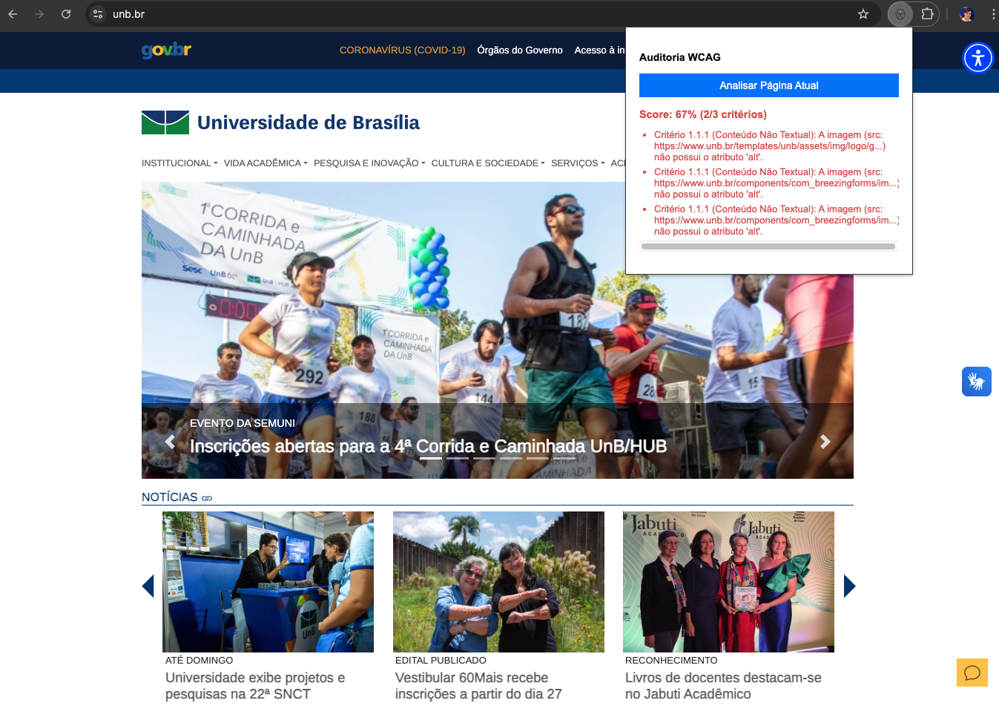

# Template: Plugin de Auditoria de Acessibilidade Web

Este repositório contém um protótipo funcional de uma extensão para o Google Chrome, desenvolvida com o objetivo de auditar páginas web com base em critérios selecionados das Diretrizes de Acessibilidade para Conteúdo Web (WCAG).

O projeto serve como um template e ponto de partida para o desenvolvimento de ferramentas de diagnóstico de acessibilidade mais robustas.

# O que é e como criar uma Extensão de Navegador?

Uma extensão de navegador é um pequeno programa de software que personaliza e adiciona funcionalidades ao navegador. Elas são construídas usando tecnologias web padrão: HTML, CSS e JavaScript.

A arquitetura de uma extensão moderna (especificamente o Manifest V3 do Chrome) é baseada em alguns componentes principais:

1. `manifest.json` : informa ao navegador o nome da extensão, a versão, as permissões necessárias e quais arquivos são responsáveis por sua funcionalidade.
2. Interface do Usuário: é a interface com a qual o usuário interage, geralmente uma pequena janela (popup.html) que aparece ao clicar no ícone da extensão na barra de ferramentas.
3. Scripts: O JavaScript (popup.js) que dá vida à extensão, ele não pode acessar diretamente o DOM da página, por motivos de segurança. Em vez disso, ele utiliza a API chrome.scripting para injetar um script ou função no contexto da página ativa.

# Funcionamento Específico deste Protótipo/Template

## 1. Estrutura de Arquivos do Projeto

```
.
├── manifest.json     # Configuração principal da extensão (MV3)
├── popup.html        # A interface do usuário (UI) da extensão
├── popup.js          # Lógica da UI e a função de auditoria injetável
└── icon.png          # Ícone exibido na barra de ferramentas do Chrome
```

## 2. Como rodar e testar?

1. Clone ou faça o download deste repositório e descompacte-o em uma pasta local.
2. Abra o Google Chrome e navegue até a página de extensões: chrome://extensions/
3. No canto superior direito da página, ative o "Modo de desenvolvedor".
4. Clique em "Carregar sem compactação" (Load unpacked).
5. Na janela que se abre, selecione a pasta completa com os arquivos do projeto.
6. Acesse qualquer website e clique no ícone da extensão para testar.
7. Resultado esperado:



# Recursos

- Google Chrome (Manifest V3): [Visão Geral das Extensões do Chrome](https://developer.chrome.com/docs/extensions/develop/migrate)
- Mozilla (Firefox): [Anatomia de uma WebExtension (MDN)](https://developer.mozilla.org/pt-BR/docs/Mozilla/Add-ons/WebExtensions/Anatomy_of_a_WebExtension)
- Microsoft Edge: [Documentação de Extensões do Edge](https://learn.microsoft.com/pt-br/microsoft-edge/extensions/)
- WCAG 2.1 (Referência): [Diretrizes de Acessibilidade para Conteúdo Web (W3C)](https://www.w3.org/WAI/WCAG22/quickref/?versions=2.1)
